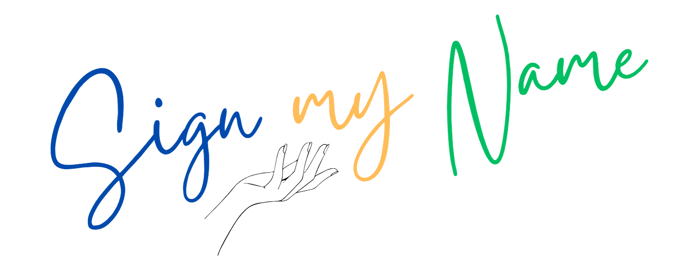

# SignMyName



SignMyName is an application that recognizes Israeli Sign Language (ISL) letter gestures and translates them into text. Using CNN models and Mediapipe image processing, it bridges the gap between the hard of hearing and those who can hear through interactive learning.

[](https://opensource.org/licenses/MIT)
[](https://www.python.org/downloads/)

## Table of Contents
- [Features](#features)
- [Technologies Used](#technologies-used)
- [Getting Started](#getting-started)
- [Usage](#usage)
- [License](#license)
- [Acknowledgments](#acknowledgments)

## Features

- **Gesture Recognition**: SignMyName employs a deep learning model to predict letter gestures from Israeli Sign Language, for use in game-like learning applications.

- **Real-Time Translation**: The application provides real-time translation of ISL gestures.

## Technologies Used
- Python 3.9+
- TensorFlow for CNN model
- Mediapipe for image processing
- Tkinter for GUI
- pygame for sounds
- cv2 for camera control and image processing
- PIL for image processing

## Getting Started

To get started with SignMyName, follow these steps:

### You must have Python 3.9 - 3.11 on your computer for this application to work.

1. **Clone the Repository**: Clone this repository to your local machine using the following command:
   ``` git clone https://github.com/Sign-My-Name/tkinter.git ```
2. **install dependencies**:
   ``` pip install -r requirements.txt ```
3. **run the application**:
   ``` py app.py ```
4. **Begin Signing**:
Once the application is running, you get the option to update your machine learning model. For the first time, you must accept as you don't have a model on your PC yet. The model is being downloaded to C:\SignMyName. If the application recognizes that a newer model exists, it will ask again for an update; you can choose whether you want to download it or not.

After the update, the application will start, and you will be on the homepage.

The homepage has 4 game-like learning screens to help learn ISL:
- **"הכר את האות"**:
 Enter a letter you want to learn and then perform the gesture that appears on the screen until successful.
- **"בואו נתרגל את האותיות"**:
 The app will show you what gesture you are performing for training and reinforcing the gestures.
- **"בנה מילה"**:
 Perform gestures one after another to build a word, with the ability to delete the last letter of a gesture. If you want the same letter twice in a row, lower your hand out of the camera view and bring it back.
- **"בואו נלמד מילים"**:
 Train on a set of 5 words: טוב, מצויין, ביי, צה"ל, and חייל to showcase the system's ability to work with words.


## License
This project is licensed under the MIT License - see the [LICENSE](LICENSE) file for details.

## Acknowledgments

We would like to thank the following individuals and organizations for their contributions to SignMyName:

- 🌸 [Sivan Cohen]
- 🚀 [Shahar Ariel]
- 🎸 [Gilad Meir]

And our guide:
- 👨‍🏫 [Amit Dunsky]